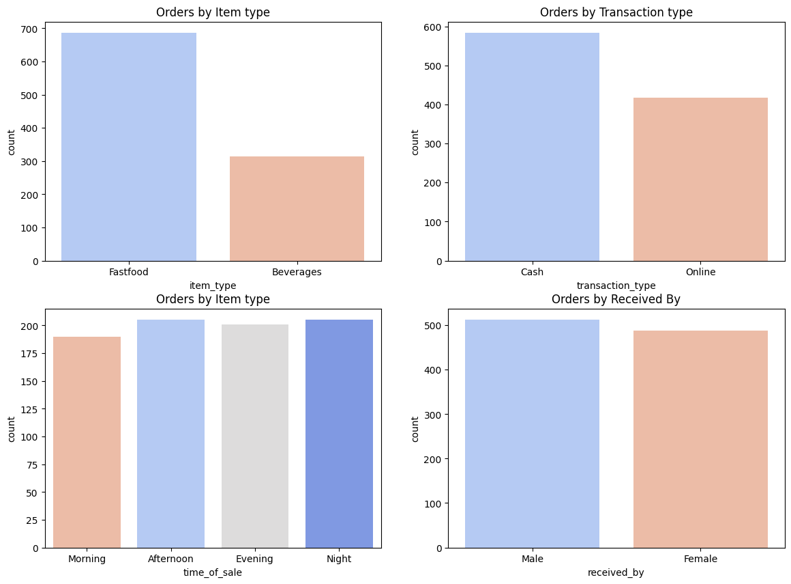
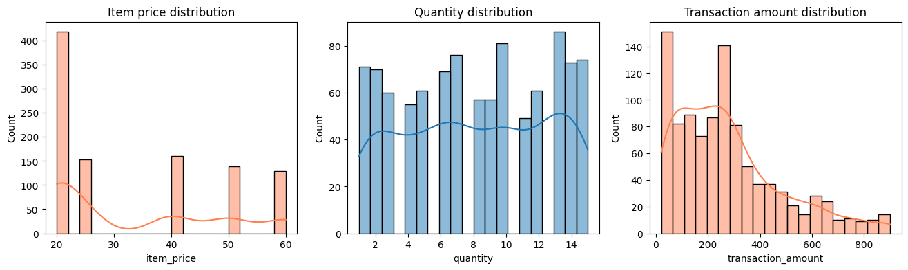
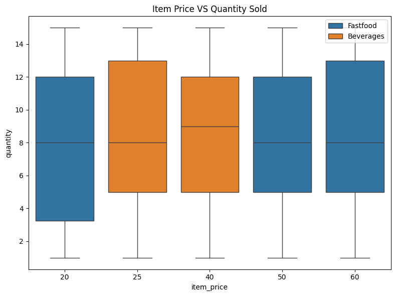
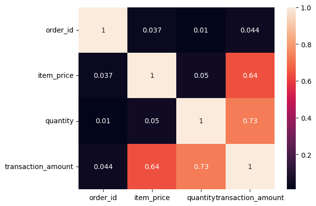

# Balaji Fast Food Sales — Exploratory Data Analysis


An exploratory data analysis (EDA) of 1,000 orders from Balaji Fast Food. The notebook cleans the raw sales data, checks that every transaction amount adds up, and uses charts to show what customers order, how they pay, when they buy, and how price, quantity and order value relate to each other.

## What this project answers

- What do customers order: **fast food** or **beverages**, and at which price points?
- How do customers pay: **cash** or **online**?
- At what **time of day** do sales happen?
- How are **price, quantity and order value** distributed, and how are they related?
- How **clean** is the data? (missing values, duplicates, date formats, amount mismatches)

## Dataset

The analysis uses the [Fast Food Sales Report](https://www.kaggle.com/datasets/rajatsurana979/fast-food-sales-report) dataset from Kaggle (`rajatsurana979/fast-food-sales-report`), included here as `Balaji_Fast_Food_Sales.csv`.

- **Size:** 1,000 orders × 10 columns
- **Menu:** 7 items in 2 categories (5 fast food, 2 beverages)
- **Order period:** 1 April 2022 – 30 March 2023 (see [Notes and known issues](#notes-and-known-issues) on date parsing)
- **Duplicate rows:** 0 (every `order_id` is unique)

### Columns

| Column | Description | Missing values |
|---|---|---:|
| `order_id` | Unique order number | 0 |
| `date` | Date of the order (stored as text in mixed formats) | 0 |
| `item_name` | Menu item ordered | 0 |
| `item_type` | `Fastfood` or `Beverages` | 0 |
| `item_price` | Price of one unit | 0 |
| `quantity` | Number of units in the order (1–15) | 0 |
| `transaction_amount` | Order total (`item_price` × `quantity`) | 0 |
| `transaction_type` | Payment method: `Cash` or `Online` | 107 |
| `received_by` | Who received the order, recorded as a salutation (`Mr.` / `Mrs.`) | 0 |
| `time_of_sale` | Time of day: `Morning`, `Afternoon`, `Evening`, `Night` or `Midnight` | 0 |

### Menu items

| Item | Category | Price | Orders |
|---|---|---:|---:|
| Aalopuri | Fastfood | 20 | 134 |
| Panipuri | Fastfood | 20 | 150 |
| Vadapav | Fastfood | 20 | 134 |
| Frankie | Fastfood | 50 | 139 |
| Sandwich | Fastfood | 60 | 129 |
| Sugarcane juice | Beverages | 25 | 153 |
| Cold coffee | Beverages | 40 | 161 |

## Analysis workflow

The notebook, `fastfood-sales-analysis.ipynb`, follows these steps:

1. **Load and inspect** – read the CSV with pandas, then check structure and data quality with `df.sample()`, `df.info()`, `df.isnull().sum()` and `df.describe()`.
2. **Clean the data** – handle missing values, fix data types and validate the amounts (see below).
3. **Univariate analysis** – count plots for item type, payment method, time of sale and `received_by`; histograms for price, quantity and order value.
4. **Bivariate analysis** – a box plot of price vs. quantity by item type and a correlation heatmap of the numeric columns.

### Data cleaning

| Issue | Handling |
|---|---|
| Duplicate rows | Checked: none found |
| `transaction_type` missing for 107 orders (10.7%) | Filled with the most frequent value, `Cash` |
| `date` stored as text | Converted to datetime with `pd.to_datetime(..., format='mixed', dayfirst=True, errors='coerce')` (see the note on date parsing below) |
| `received_by` stored as `Mr.` / `Mrs.` | Recoded to `Male` / `Female` |
| Do the amounts add up? | `transaction_amount` compared with `item_price` × `quantity`: 0 mismatches |

## Key findings

- **Fast food dominates orders** – 686 orders (68.6%) vs. 314 beverage orders (31.4%). Five of the seven menu items are fast food.
- **Cash is the most common payment method** – 583 orders vs. 417 online, after filling the 107 missing values with `Cash` (476 orders are recorded as cash).
- **Sales are spread evenly across the day** – Night (205), Afternoon (205), Evening (201), Midnight (199) and Morning (190) each account for about a fifth of orders.
- **Orders are split almost evenly by `received_by`** – 512 `Male` vs. 488 `Female`.
- **Prices cluster at the low end** – there are five price points (20, 25, 40, 50, 60) with a median of 25, and 41.8% of orders are for the three items priced at 20.
- **Order size varies widely** – quantity per order ranges from 1 to 15 (mean 8.2, median 8), and order value ranges from 20 to 900 (mean 275.23, median 240) with a long tail of larger orders.
- **Quantity does not depend on price** – the median quantity is 8 or 9 at every price point, and the correlation between `item_price` and `quantity` is only 0.05.
- **Order value is driven by both quantity and price** – `transaction_amount` correlates with `quantity` (0.73) and `item_price` (0.64), while `order_id` is unrelated to every other column (0.01–0.04).
- **The data is clean** – no duplicates, `transaction_type` is the only column with missing values, and every amount equals price × quantity.

## Visualizations

### Orders by item type, payment method, time of sale and received by



### Distributions of price, quantity and order value



### Price vs. quantity



### Correlation of numeric columns



## Notes and known issues

- **Date parsing.** The `date` column mixes two formats: `M/D/YYYY` (e.g. `8/23/2022`, 597 rows) and `MM-DD-YYYY` (e.g. `07-03-2022`, 403 rows). The notebook parses them with `dayfirst=True`, which appears to misread the dashed dates: 371 of those 403 rows get the wrong date and the range stretches from January 2022 to December 2023. Reading every date month-first, `pd.to_datetime(df['date'], format='mixed')`, gives a clean 12-month window (1 April 2022 – 30 March 2023) with roughly 66–100 orders per month. No chart in the notebook uses `date` yet, but any monthly or trend analysis should use the month-first parse.
- **`Midnight` is missing from the time-of-sale chart.** The notebook sets `order=['Morning', 'Afternoon', 'Evening', 'Night']`, so the 199 `Midnight` orders (19.9%) are not drawn in that panel. The panel is also titled "Orders by Item type" although it shows time of sale.
- **Missing payment types are filled with `Cash`.** This assumes all 107 missing values were cash payments and raises the `Cash` count from 476 to 583, so treat the Cash vs. Online split as approximate.
- **Use pandas 2.x.** The notebook fills missing values with `df['transaction_type'].fillna(..., inplace=True)`. In pandas 3.0 this chained in-place pattern no longer modifies the DataFrame, so the fill would silently do nothing. Install `pandas<3`, or rewrite the line as `df['transaction_type'] = df['transaction_type'].fillna(...)`.
- **Local runs need two small changes.** The notebook reads `Balaji Fast Food Sales.csv` (with spaces) from Kaggle's input path, and its first cell is Kaggle starter code. See [Getting started](#getting-started).

## Repository structure

```text
.
├── README.md
├── fastfood-sales-analysis.ipynb     # analysis notebook
├── Balaji_Fast_Food_Sales.csv        # dataset
├── univariate_countplots.png         # charts exported from the notebook
├── numeric_distributions.png
├── price_vs_quantity_boxplot.png
└── correlation_heatmap.png
```

## Getting started

**Prerequisites:** Python 3.10 or newer (the notebook was run on Python 3.12).

1. **Download the project** – on the repository page click the green **Code** button, then **Download ZIP**, and unzip it. (If you use Git, you can clone the repository instead.)

2. **Create a virtual environment** (optional but recommended)

   ```bash
   python -m venv .venv
   source .venv/bin/activate      # Windows: .venv\Scripts\activate
   ```

3. **Install the dependencies**

   ```bash
   pip install numpy "pandas<3" matplotlib seaborn notebook
   ```

4. **Launch Jupyter and open the notebook**

   ```bash
   jupyter notebook fastfood-sales-analysis.ipynb
   ```

5. **Adjust the notebook for a local run**

   - Skip the first cell. It is Kaggle's default starter code and imports `kagglehub`, which is only needed on Kaggle.
   - In the cell that loads the data, replace the Kaggle path with the local file:

     ```python
     df = pd.read_csv("Balaji_Fast_Food_Sales.csv")
     ```

   Then run the remaining cells from top to bottom.

## Tech stack

Python 3 · pandas · NumPy · Matplotlib · Seaborn · Jupyter Notebook

## Ideas for extending the analysis

- Complete the **Revenue Analysis** section: sales by item, category, time of day and month (after fixing the date parsing).
- Compare cash and online orders by value, item and time of day.
- Rank menu items by orders and by revenue to find the top sellers.
- Add `Midnight` to the time-of-sale chart so all five periods are shown.

## Acknowledgements

Dataset: [Fast Food Sales Report](https://www.kaggle.com/datasets/rajatsurana979/fast-food-sales-report) by `rajatsurana979` on Kaggle. See the dataset page for its license and terms of use.
